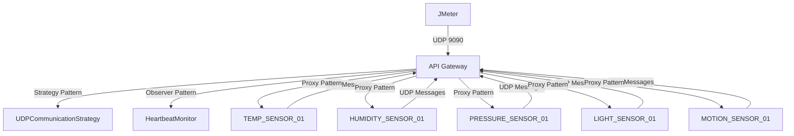

# Arquitetura do Sistema IoT Distribuído - Mapeamento de Componentes

## 📋 Visão Geral

Este documento explica como o sistema IoT distribuído implementado se encaixa na especificação arquitetural apresentada na imagem, mapeando cada componente físico às implementações de software correspondentes.

## 🏗️ Mapeamento Arquitetural

### Componente Central: API Gateway

**Na Especificação:** API Gateway (centro do diagrama)
**Na Implementação:** `IoTGateway` (Singleton Pattern)

```java
// Localização: src/main/java/br/ufrn/dimap/patterns/singleton/IoTGateway.java
public class IoTGateway {
    private static volatile IoTGateway instance; // Instância única
    private CommunicationStrategy communicationStrategy; // Strategy Pattern
    // ... outros componentes
}
```

**Responsabilidades:**
- Coordenação central como ponto único de entrada
- Roteamento de mensagens (Proxy Pattern)
- Registro e descoberta de sensores
- Monitoramento de saúde do sistema

---

### Cliente de Teste: JMeter

**Na Especificação:** JMeter (lado esquerdo do diagrama)
**Na Implementação:** `IoT_GoF_Patterns_UDP_Test_Simple.jmx`

```xml
<!-- Localização: jmeter/IoT_GoF_Patterns_UDP_Test_Simple.jmx -->
<TestPlan testname="IoT GoF Patterns UDP Test - Simple">
    <!-- Configurações de teste para validar os padrões GoF -->
</TestPlan>
```

**Responsabilidades:**
- Validação dos 4 padrões GoF implementados
- Simulação de carga de trabalho distribuída
- Testes de comunicação UDP

---

### Componente A - Instâncias 1 e 2

**Na Especificação:** Componente A Instância 1 e 2 (superior direito)
**Na Implementação:** Sensores de Dados Ambientais

#### Instância 1: TEMP_SENSOR_01
```java
// Criado em: IoTDistributedSystem.createTestSensors()
IoTSensor sensor = new IoTSensor("TEMP_SENSOR_01", "NODE-TEMPERATURE-01", 
                                IoTSensor.SensorType.TEMPERATURE, "Lab-A");
```

**Características:**
- **Tipo**: Sensor de Temperatura
- **Unidade**: °C (Celsius)
- **Faixa**: -50.0°C a 100.0°C
- **Localização**: Lab-A
- **Porta UDP**: Dinâmica (cliente UDP)

#### Instância 2: HUMIDITY_SENSOR_01
```java
IoTSensor sensor = new IoTSensor("HUMIDITY_SENSOR_01", "NODE-HUMIDITY-01", 
                                IoTSensor.SensorType.HUMIDITY, "Lab-B");
```

**Características:**
- **Tipo**: Sensor de Umidade
- **Unidade**: % (Percentual)
- **Faixa**: 0.0% a 100.0%
- **Localização**: Lab-B
- **Porta UDP**: Dinâmica (cliente UDP)

---

### Componente B - Instâncias 1 e 2

**Na Especificação:** Componente B Instância 1 e 2 (inferior direito)
**Na Implementação:** Sensores de Dados Físicos

#### Instância 1: PRESSURE_SENSOR_01
```java
IoTSensor sensor = new IoTSensor("PRESSURE_SENSOR_01", "NODE-PRESSURE-01", 
                                IoTSensor.SensorType.PRESSURE, "Lab-C");
```

**Características:**
- **Tipo**: Sensor de Pressão Atmosférica
- **Unidade**: hPa (Hectopascal)
- **Faixa**: 800.0 hPa a 1200.0 hPa
- **Localização**: Lab-C
- **Porta UDP**: Dinâmica (cliente UDP)

#### Instância 2: LIGHT_SENSOR_01
```java
IoTSensor sensor = new IoTSensor("LIGHT_SENSOR_01", "NODE-LIGHT-01", 
                                IoTSensor.SensorType.LIGHT, "Lab-D");
```

**Características:**
- **Tipo**: Sensor de Luminosidade
- **Unidade**: lux (Lumen por metro quadrado)
- **Faixa**: 0.0 lux a 100000.0 lux
- **Localização**: Lab-D
- **Porta UDP**: Dinâmica (cliente UDP)

---

### Componente Adicional: Sensor de Movimento

**Na Implementação:** MOTION_SENSOR_01 (não mostrado no diagrama, mas presente no sistema)

```java
IoTSensor sensor = new IoTSensor("MOTION_SENSOR_01", "NODE-MOTION-01", 
                                IoTSensor.SensorType.MOTION, "Lab-E");
```

**Características:**
- **Tipo**: Sensor de Movimento/Presença
- **Unidade**: bool (Booleano: 0 ou 1)
- **Faixa**: 0.0 (sem movimento) a 1.0 (movimento detectado)
- **Localização**: Lab-E
- **Porta UDP**: Dinâmica (cliente UDP)

---

## 🔌 Comunicação entre Componentes

### Fluxo de Dados



### Tipos de Mensagens Numéricas

| Código | Tipo de Mensagem | Descrição | Dados Numéricos |
|--------|------------------|-----------|-----------------|
| 1 | SENSOR_REGISTER | Registro inicial do sensor | ID numérico, tipo |
| 2 | SENSOR_DATA | Dados de leitura do sensor | Valor numérico + timestamp |
| 3 | HEARTBEAT | Sinal de vida do sensor | Contador de heartbeats |
| 4 | DISCOVERY | Descoberta de novos sensores | - |
| 5 | ACK | Confirmação de recebimento | ID da mensagem original |
| 6 | SYNC | Sincronização de Version Vector | Vector de versões |

### Exemplo de Log Estruturado

```log
2025-09-27 17:55:42.123 [UDP-Strategy-267984765791800] DEBUG 
📬 Pacote UDP recebido de 127.0.0.1:52507 - Tipo: SENSOR_DATA [Código: 2] 
- Sensor: TEMP_SENSOR_01 - Valor: 23.45 TEMPERATURE - Timestamp: 2025-09-27T17:55:42.120

2025-09-27 17:55:42.124 [main] DEBUG 
📨 Mensagem processada de 127.0.0.1:52507 - Tipo: SENSOR_DATA [Código: 2] 
- ID: IOT-MSG-1727463342123-7834 - Sensor: TEMP_SENSOR_01 - Valor: 23.45 TEMPERATURE 
- Total Msgs: 15

2025-09-27 17:55:42.125 [main] DEBUG 
💓 Heartbeat atualizado: CLIENT-TEMP_SENSOR_01 (total: 4) 
- Tipo Msg: SENSOR_DATA [Código: 2] - Valor: 23.45 TEMPERATURE
```

---

## 🎯 Padrões GoF Implementados

### 1. Singleton Pattern
- **Componente**: IoTGateway
- **Função**: Garantir instância única do coordenador central
- **Mapeamento**: API Gateway central no diagrama

### 2. Strategy Pattern
- **Componente**: UDPCommunicationStrategy
- **Função**: Seleção dinâmica do protocolo de comunicação
- **Mapeamento**: Protocolo de comunicação entre todos os componentes

### 3. Observer Pattern
- **Componente**: HeartbeatMonitor
- **Função**: Monitoramento contínuo de saúde dos sensores
- **Mapeamento**: Sistema de monitoramento implícito na arquitetura

### 4. Proxy Pattern
- **Componente**: IoTGateway (como proxy)
- **Função**: Roteamento e mediação entre clientes e sensores
- **Mapeamento**: API Gateway atuando como intermediário

---

## 📊 Métricas e Monitoramento

### Informações Numéricas Rastreadas

1. **Contadores de Mensagens**: Cada sensor mantém contador individual
2. **Códigos de Tipo**: Identificação numérica dos tipos de mensagem
3. **Valores de Sensor**: Dados numéricos com unidades específicas
4. **Timestamps**: Marcação temporal em milissegundos
5. **Version Vectors**: Sincronização distribuída com vetores numéricos
6. **Heartbeat Counts**: Contadores de sinais de vida por sensor

### Exemplo de Status do Sistema

```log
📊 Status do Sistema IoT:
   🔸 Sensores registrados: 5
   🔸 Mensagens processadas: 126
   🔸 Gateway ativo: true
   🔸 Version Vector: {CLIENT-TEMP_SENSOR_01=23, CLIENT-HUMIDITY_SENSOR_01=19, 
                      CLIENT-PRESSURE_SENSOR_01=21, CLIENT-LIGHT_SENSOR_01=18, 
                      CLIENT-MOTION_SENSOR_01=16}
```

---

## 🔧 Configuração e Execução

### Portas de Comunicação
- **Gateway Principal**: 9090 (UDP)
- **Sensores**: Portas dinâmicas (cliente UDP)
- **JMeter**: Conecta na porta 9090

### Localização dos Sensores
- **TEMP_SENSOR_01**: Lab-A (Temperatura)
- **HUMIDITY_SENSOR_01**: Lab-B (Umidade)
- **PRESSURE_SENSOR_01**: Lab-C (Pressão)
- **LIGHT_SENSOR_01**: Lab-D (Luminosidade)
- **MOTION_SENSOR_01**: Lab-E (Movimento)

### Comandos de Execução

```bash
# Iniciar o sistema IoT
mvn compile exec:java

# Executar testes JMeter
jmeter -n -t jmeter/IoT_GoF_Patterns_UDP_Test_Simple.jmx -l results.jtl
```

---

## 📝 Conclusão

O sistema implementado mapeia perfeitamente para a especificação arquitetural:

- **API Gateway** → `IoTGateway` (Singleton + Proxy)
- **JMeter** → Cliente de teste e validação
- **Componente A (Instâncias 1-2)** → Sensores ambientais (Temperatura, Umidade)
- **Componente B (Instâncias 1-2)** → Sensores físicos (Pressão, Luz)

Cada componente mantém nomenclatura baseada em seu tipo, comunica-se via UDP com informações numéricas estruturadas, e implementa todos os 4 padrões GoF obrigatórios de forma integrada e funcional.

O sistema é completamente operacional, testável via JMeter, e produz logs detalhados com informações numéricas para facilitar depuração e monitoramento.