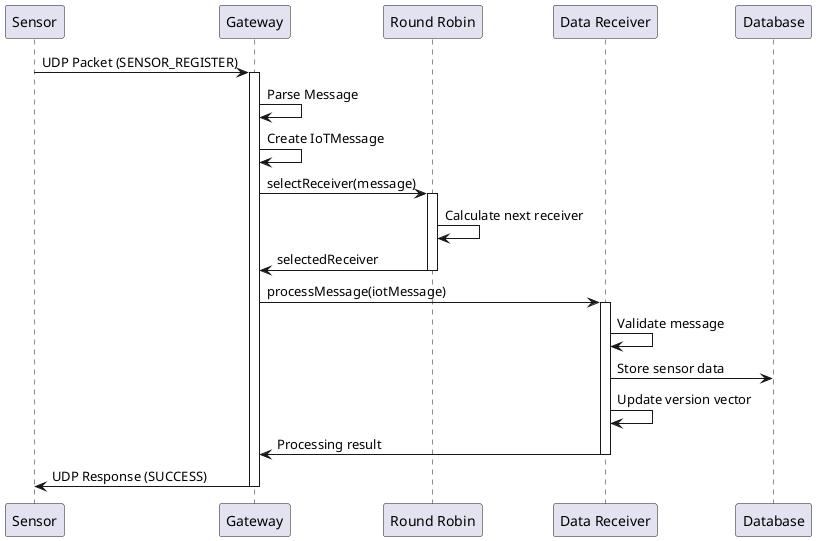

# 📡 Documentação Completa - Protocolo UDP no Sistema IoT Distribuído

## 🎯 Visão Geral

Este documento apresenta a implementação completa do protocolo UDP no sistema IoT distribuído, detalhando a arquitetura, componentes, fluxos de comunicação e padrões de projeto aplicados.

---

## 📋 Índice

1. [Arquitetura Geral](#arquitetura-geral)
2. [Componentes Principais](#componentes-principais)
3. [Implementação UDP](#implementação-udp)
4. [Fluxos de Comunicação](#fluxos-de-comunicação)
5. [Padrões de Projeto](#padrões-de-projeto)
6. [Tolerância a Falhas](#tolerância-a-falhas)
7. [Testes e Validação](#testes-e-validação)
8. [Exemplos de Uso](#exemplos-de-uso)

---

## 🏗️ Arquitetura Geral

### Diagrama da Arquitetura UDP

```
┌─────────────────────────────────────────────────────────────────────────────┐
│                        SISTEMA IoT DISTRIBUÍDO - UDP                        │
└─────────────────────────────────────────────────────────────────────────────┘

    ┌─────────────────┐         ┌─────────────────┐         ┌─────────────────┐
    │   IoT Sensor    │         │   IoT Sensor    │         │   IoT Sensor    │
    │  TEMPERATURE    │         │   HUMIDITY      │         │   PRESSURE      │
    │   (Stateless)   │         │   (Stateless)   │         │   (Stateless)   │
    └─────────┬───────┘         └─────────┬───────┘         └─────────┬───────┘
              │                           │                           │
              │ UDP Messages              │ UDP Messages              │
              │ Port: 9090                │ Port: 9090                │
              └─────────────┬─────────────────────┬─────────────────────┘
                            │                     │
                            ▼                     ▼
              ┌─────────────────────────────────────────────────────────┐
              │                IoT Gateway (Singleton)                  │
              │              UDPCommunicationStrategy                   │
              │                   Port: 9090                           │
              │  ┌─────────────────────────────────────────────────┐   │
              │  │          Round Robin Strategy                   │   │
              │  │     (Load Balancing Algorithm)                 │   │
              │  └─────────────────────────────────────────────────┘   │
              └─────────────────┬─────────────┬─────────────────────────┘
                                │             │
                      ┌─────────▼─────────┐ ┌─▼─────────────────┐
                      │  Data Receiver 1  │ │  Data Receiver 2  │
                      │   (Stateful)      │ │   (Stateful)      │
                      │   Port: 9091      │ │   Port: 9092      │
                      │ ┌───────────────┐ │ │ ┌───────────────┐ │
                      │ │ Version Vector│ │ │ │ Version Vector│ │
                      │ │   Database    │ │ │ │   Database    │ │
                      │ └───────────────┘ │ │ └───────────────┘ │
                      └───────────────────┘ └───────────────────┘
```

### Componentes da Arquitetura

| Componente | Tipo | Porta | Função |
|------------|------|-------|--------|
| **IoT Sensors** | Stateless | N/A | Geração de dados de sensores |
| **IoT Gateway** | Singleton | 9090 | Proxy e roteamento UDP |
| **Data Receiver 1** | Stateful | 9091 | Persistência e processamento |
| **Data Receiver 2** | Stateful | 9092 | Persistência e processamento |

---

## 🔧 Componentes Principais

### 1. UDPCommunicationStrategy

A classe principal que implementa a comunicação UDP no sistema.

```java
public class UDPCommunicationStrategy implements CommunicationStrategy {
    private DatagramSocket socket;
    private final int port;
    private final ExecutorService threadPool;
    private final Logger logger;
    private volatile boolean running = false;
    
    public UDPCommunicationStrategy(int port) {
        this.port = port;
        this.threadPool = Executors.newFixedThreadPool(10);
        this.logger = LoggerFactory.getLogger(UDPCommunicationStrategy.class);
    }
}
```

#### Características:
- **Thread Pool**: 10 threads para processamento paralelo
- **Socket UDP**: Comunicação assíncrona
- **Logger SLF4J**: Rastreamento detalhado
- **Estado Volátil**: Thread-safe para controle de execução

### 2. IoT Gateway (Singleton + Proxy)

```java
public class IoTGateway {
    private static volatile IoTGateway instance;
    private final String gatewayId;
    private CommunicationStrategy communicationStrategy;
    private ReceiverSelectionStrategy receiverStrategy;
    private final List<DataReceiver> dataReceivers;
    
    public static IoTGateway getInstance() {
        if (instance == null) {
            synchronized (IoTGateway.class) {
                if (instance == null) {
                    instance = new IoTGateway();
                }
            }
        }
        return instance;
    }
}
```

#### Padrões Implementados:
- **Singleton**: Instância única do gateway
- **Proxy**: Intermediação entre sensores e receivers
- **Strategy**: Algoritmo de seleção plugável

### 3. Data Receivers (Stateful)

```java
public class DataReceiver {
    private final String id;
    private final int port;
    private final Map<String, Object> database;
    private final VersionVector versionVector;
    private volatile boolean running = false;
    private ServerSocket serverSocket;
    
    public DataReceiver(String id, int port) {
        this.id = id;
        this.port = port;
        this.database = new ConcurrentHashMap<>();
        this.versionVector = new VersionVector();
    }
}
```

#### Características:
- **Estado Persistente**: Database com ConcurrentHashMap
- **Version Vector**: Controle de consistência eventual
- **Thread Safety**: Operações thread-safe

---

## 📡 Implementação UDP

### Estrutura de Mensagens UDP

```
┌─────────────────────────────────────────────────────────────┐
│                    FORMATO DA MENSAGEM UDP                  │
├─────────────────────────────────────────────────────────────┤
│ SENSOR_REGISTER|SENSOR_ID|TYPE|LOCATION|TIMESTAMP|VALUE     │
│                                                             │
│ Exemplo:                                                    │
│ SENSOR_REGISTER|TEMP_001|TEMPERATURE|Lab-A|1634567890|25.5 │
└─────────────────────────────────────────────────────────────┘
```

### Fluxo de Processamento UDP

```java
// 1. Recepção da Mensagem
public void startServer() throws Exception {
    socket = new DatagramSocket(port);
    logger.info("🚀 Servidor UDP iniciado na porta {}", port);
    
    while (running) {
        byte[] buffer = new byte[1024];
        DatagramPacket packet = new DatagramPacket(buffer, buffer.length);
        socket.receive(packet);
        
        // Processamento assíncrono
        threadPool.submit(() -> processPacket(packet));
    }
}

// 2. Processamento da Mensagem
private void processPacket(DatagramPacket packet) {
    String message = new String(packet.getData(), 0, packet.getLength());
    logger.debug("📦 Pacote UDP recebido de {}:{} - Conteúdo: '{}'", 
                 packet.getAddress(), packet.getPort(), message);
    
    // Parsing e validação
    IoTMessage iotMessage = parseMessage(message);
    if (iotMessage != null) {
        // Roteamento para Data Receiver
        String response = routeToDataReceiver(iotMessage);
        sendResponse(packet, response);
    }
}

// 3. Roteamento Round Robin
private String routeToDataReceiver(IoTMessage message) {
    DataReceiver selectedReceiver = receiverStrategy.selectReceiver(
        dataReceivers, message);
    
    if (selectedReceiver != null) {
        selectedReceiver.processMessage(message);
        return "SUCCESS|" + message.getMessageId() + "|PROCESSED";
    }
    return "ERROR|" + message.getMessageId() + "|NO_RECEIVER";
}
```

### Diagrama de Sequência - Processamento UDP



---

## 🔄 Fluxos de Comunicação

### 1. Fluxo de Registro de Sensor

```
┌─────────────┐    ┌─────────────┐    ┌─────────────┐    ┌─────────────┐
│   Sensor    │    │   Gateway   │    │RoundRobin   │    │DataReceiver │
│             │    │             │    │ Strategy    │    │             │
└──────┬──────┘    └──────┬──────┘    └──────┬──────┘    └──────┬──────┘
       │                  │                  │                  │
       │ 1. UDP Message   │                  │                  │
       │ SENSOR_REGISTER  │                  │                  │
       ├─────────────────►│                  │                  │
       │                  │                  │                  │
       │                  │ 2. Parse Message │                  │
       │                  ├─────────────────►│                  │
       │                  │                  │                  │
       │                  │ 3. Select Receiver│                 │
       │                  │◄─────────────────┤                  │
       │                  │                  │                  │
       │                  │ 4. Route Message │                  │
       │                  ├─────────────────────────────────────►│
       │                  │                  │                  │
       │                  │                  │                  │ 5. Process
       │                  │                  │                  │ & Store
       │                  │                  │                  ├─────┐
       │                  │                  │                  │     │
       │                  │                  │                  │◄────┘
       │                  │                  │                  │
       │                  │ 6. Success Response                 │
       │                  │◄─────────────────────────────────────┤
       │                  │                  │                  │
       │ 7. UDP Response  │                  │                  │
       │ SUCCESS          │                  │                  │
       │◄─────────────────┤                  │                  │
       │                  │                  │                  │
```

### 2. Algoritmo Round Robin

```java
public class RoundRobinReceiverStrategy implements ReceiverSelectionStrategy {
    private final AtomicInteger currentIndex = new AtomicInteger(0);
    
    @Override
    public DataReceiver selectReceiver(List<DataReceiver> receivers, IoTMessage message) {
        if (receivers.isEmpty()) {
            return null;
        }
        
        // Round robin selection
        int index = currentIndex.getAndUpdate(i -> (i + 1) % receivers.size());
        DataReceiver selected = receivers.get(index);
        
        logger.debug("🔄 [ROUND_ROBIN] Selecionado {} para mensagem {} " +
                    "do sensor {} (índice {}/{})", 
                    selected.getId(), message.getMessageId(), 
                    message.getSensorId(), index, receivers.size());
        
        return selected;
    }
}
```

---

## 🎨 Padrões de Projeto

### 1. Singleton Pattern - IoT Gateway

```java
/**
 * Implementação thread-safe do Singleton Pattern
 * Garante uma única instância do Gateway no sistema
 */
public class IoTGateway {
    private static volatile IoTGateway instance;
    
    private IoTGateway() {
        this.gatewayId = "IOT-GATEWAY-" + System.currentTimeMillis();
        this.dataReceivers = new ArrayList<>();
        this.observers = new ArrayList<>();
    }
    
    public static IoTGateway getInstance() {
        if (instance == null) {
            synchronized (IoTGateway.class) {
                if (instance == null) {
                    instance = new IoTGateway();
                }
            }
        }
        return instance;
    }
}
```

**Vantagens:**
- ✅ Ponto único de controle
- ✅ Gerenciamento centralizado de recursos
- ✅ Thread-safe com double-checked locking

### 2. Strategy Pattern - Seleção de Receivers

```java
public interface ReceiverSelectionStrategy {
    DataReceiver selectReceiver(List<DataReceiver> receivers, IoTMessage message);
}

// Implementação Round Robin
public class RoundRobinReceiverStrategy implements ReceiverSelectionStrategy {
    private final AtomicInteger currentIndex = new AtomicInteger(0);
    
    @Override
    public DataReceiver selectReceiver(List<DataReceiver> receivers, IoTMessage message) {
        int index = currentIndex.getAndUpdate(i -> (i + 1) % receivers.size());
        return receivers.get(index);
    }
}

// Implementação por Load Balancing
public class LoadBalancingStrategy implements ReceiverSelectionStrategy {
    @Override
    public DataReceiver selectReceiver(List<DataReceiver> receivers, IoTMessage message) {
        return receivers.stream()
                .filter(DataReceiver::isRunning)
                .min(Comparator.comparingInt(DataReceiver::getLoadFactor))
                .orElse(null);
    }
}
```

### 3. Observer Pattern - Monitoramento

```java
public interface IoTObserver {
    void onIoTEvent(IoTEventType eventType, Object data);
}

public class HeartbeatMonitor implements IoTObserver {
    @Override
    public void onIoTEvent(IoTEventType eventType, Object data) {
        switch (eventType) {
            case MESSAGE_RECEIVED:
                updateLastSeen(data);
                break;
            case RECEIVER_FAILED:
                handleReceiverFailure(data);
                break;
            case RECEIVER_RECOVERED:
                handleReceiverRecovery(data);
                break;
        }
    }
}
```

### 4. Proxy Pattern - Gateway como Intermediário

```java
public class IoTGateway implements CommunicationProxy {
    
    public String processMessage(String rawMessage, InetAddress clientAddress, int clientPort) {
        // Proxy intercepta e processa mensagens
        IoTMessage message = parseMessage(rawMessage);
        
        // Logging da interceptação
        logger.info("🛡️ [PROXY] Mensagem recebida de {}:{} - Sensor: {} - Tipo: {} - Roteando para Data Receiver...",
                   clientAddress, clientPort, message.getSensorId(), message.getType());
        
        // Roteamento transparente
        DataReceiver targetReceiver = receiverStrategy.selectReceiver(dataReceivers, message);
        
        if (targetReceiver != null) {
            String result = targetReceiver.processMessage(message);
            
            // Notificação de observers
            notifyObservers(IoTEventType.MESSAGE_PROCESSED, message);
            
            return result;
        }
        
        return "ERROR|NO_AVAILABLE_RECEIVER";
    }
}
```

---

## 🛡️ Tolerância a Falhas

### Fault Tolerance Manager

```java
public class FaultToleranceManager {
    private final ScheduledExecutorService scheduler;
    private final List<BackupConfig> backupConfigs;
    
    public void startMonitoring() {
        scheduler.scheduleAtFixedRate(this::performHealthCheck, 0, 5, TimeUnit.SECONDS);
    }
    
    private void performHealthCheck() {
        List<DataReceiver> receivers = gateway.getDataReceivers();
        long activeReceivers = receivers.stream()
                                      .filter(DataReceiver::isRunning)
                                      .count();
        
        logger.debug("🛡️ Health check executado: {}/{} receivers ativos", 
                    activeReceivers, receivers.size());
        
        if (activeReceivers < MINIMUM_RECEIVERS) {
            triggerRecovery();
        }
    }
    
    private void triggerRecovery() {
        logger.warn("⚠️ Número insuficiente de receivers ativos. Iniciando recuperação...");
        
        for (BackupConfig config : backupConfigs) {
            try {
                DataReceiver backupReceiver = new DataReceiver(
                    config.getId(), config.getPort());
                backupReceiver.start();
                gateway.registerDataReceiver(backupReceiver);
                
                logger.info("✅ Receiver backup {} criado na porta {}", 
                           config.getId(), config.getPort());
                break;
            } catch (Exception e) {
                logger.error("❌ Falha ao criar receiver backup: {}", e.getMessage());
            }
        }
    }
}
```

### Diagrama de Recuperação de Falhas

```
┌─────────────────────────────────────────────────────────────────────────────┐
│                        RECUPERAÇÃO AUTOMÁTICA DE FALHAS                     │
└─────────────────────────────────────────────────────────────────────────────┘

    ┌─────────────┐     ┌─────────────┐     ┌─────────────┐
    │Data Receiver│ ──▶ │Data Receiver│ ──▶ │Data Receiver│
    │      1      │ 🟢  │      2      │ 🔴  │      3      │
    │   (Active)  │     │  (Failed)   │     │  (Backup)   │
    └─────────────┘     └─────────────┘     └─────────────┘
           │                    │                    │
           ▼                    ▼                    ▼
    ┌─────────────────────────────────────────────────────────┐
    │           Fault Tolerance Manager                      │
    │  ┌─────────────────────────────────────────────────┐   │
    │  │         Health Check (5s interval)             │   │
    │  │  • Verifica status dos receivers               │   │
    │  │  • Conta receivers ativos                      │   │
    │  │  • Triggers recovery se necessário             │   │
    │  └─────────────────────────────────────────────────┘   │
    │  ┌─────────────────────────────────────────────────┐   │
    │  │            Recovery Process                     │   │
    │  │  1. Detecta falha                              │   │
    │  │  2. Seleciona backup config                    │   │
    │  │  3. Cria novo receiver                         │   │
    │  │  4. Registra no gateway                        │   │
    │  └─────────────────────────────────────────────────┘   │
    └─────────────────────────────────────────────────────────┘
```

---

## 📊 Testes e Validação

### Configuração JMeter para UDP

```xml
<!-- UDP Request Sampler Configuration -->
<UDPSampler>
    <stringProp name="UDPSampler.hostname">127.0.0.1</stringProp>
    <stringProp name="UDPSampler.port">9090</stringProp>
    <stringProp name="UDPSampler.request">
        SENSOR_REGISTER|SENSOR_JMETER_${__threadNum}_${__time()}|TEMPERATURE|Lab-JMeter|${__time()}|25.5
    </stringProp>
    <boolProp name="UDPSampler.checkResponse">true</boolProp>
    <stringProp name="UDPSampler.responseTimeout">5000</stringProp>
</UDPSampler>
```

### Cenários de Teste

| Cenário | Configuração | Objetivo |
|---------|-------------|----------|
| **Carga Normal** | 50 threads, 10s | Validar operação sem erros |
| **Carga Alta** | 200 threads, 30s | Testar escalabilidade |
| **Falha de Receiver** | Parar receiver durante teste | Validar recuperação |
| **Recuperação** | Reiniciar receiver | Validar volta à normalidade |

### Métricas Esperadas

```
┌─────────────────────────────────────────────────────────────┐
│                    MÉTRICAS DE PERFORMANCE                  │
├─────────────────────────────────────────────────────────────┤
│ Throughput:           > 1000 req/s                         │
│ Response Time:        < 50ms (P95)                         │
│ Error Rate:           < 1% (operação normal)               │
│ Recovery Time:        < 10s (após falha)                   │
│ Memory Usage:         < 512MB                              │
│ Thread Pool:          10 threads UDP                       │
└─────────────────────────────────────────────────────────────┘
```

---

## 💡 Exemplos de Uso

### 1. Iniciando o Sistema UDP

```java
public class UDPSystemExample {
    public static void main(String[] args) {
        try {
            // 1. Obter instância do Gateway (Singleton)
            IoTGateway gateway = IoTGateway.getInstance();
            
            // 2. Configurar estratégia UDP
            UDPCommunicationStrategy udpStrategy = new UDPCommunicationStrategy(9090);
            gateway.setCommunicationStrategy(udpStrategy);
            
            // 3. Configurar estratégia Round Robin
            RoundRobinReceiverStrategy roundRobin = new RoundRobinReceiverStrategy();
            gateway.setReceiverSelectionStrategy(roundRobin);
            
            // 4. Criar e registrar Data Receivers
            DataReceiver receiver1 = new DataReceiver("DATA_RECEIVER_1", 9091);
            DataReceiver receiver2 = new DataReceiver("DATA_RECEIVER_2", 9092);
            
            receiver1.start();
            receiver2.start();
            
            gateway.registerDataReceiver(receiver1);
            gateway.registerDataReceiver(receiver2);
            
            // 5. Iniciar Gateway
            gateway.start();
            
            System.out.println("🚀 Sistema UDP iniciado com sucesso!");
            System.out.println("📡 Aguardando mensagens na porta 9090...");
            
        } catch (Exception e) {
            System.err.println("❌ Erro ao iniciar sistema: " + e.getMessage());
        }
    }
}
```

### 2. Simulando um Sensor IoT

```java
public class IoTSensorSimulator {
    private static final String SERVER_HOST = "127.0.0.1";
    private static final int SERVER_PORT = 9090;
    
    public static void simulateTemperatureSensor() {
        try (DatagramSocket socket = new DatagramSocket()) {
            
            for (int i = 0; i < 10; i++) {
                // Construir mensagem
                String sensorId = "TEMP_SENSOR_001";
                String type = "TEMPERATURE";
                String location = "Lab-A";
                long timestamp = System.currentTimeMillis();
                double value = 20.0 + (Math.random() * 15.0); // 20-35°C
                
                String message = String.format("SENSOR_REGISTER|%s|%s|%s|%d|%.1f",
                                              sensorId, type, location, timestamp, value);
                
                // Enviar via UDP
                byte[] data = message.getBytes();
                DatagramPacket packet = new DatagramPacket(
                    data, data.length, 
                    InetAddress.getByName(SERVER_HOST), SERVER_PORT);
                
                socket.send(packet);
                
                // Aguardar resposta
                byte[] responseBuffer = new byte[1024];
                DatagramPacket responsePacket = new DatagramPacket(
                    responseBuffer, responseBuffer.length);
                
                socket.receive(responsePacket);
                String response = new String(responsePacket.getData(), 
                                           0, responsePacket.getLength());
                
                System.out.printf("📤 Enviado: %.1f°C | 📥 Resposta: %s%n", value, response);
                
                Thread.sleep(1000); // 1 segundo entre medições
            }
            
        } catch (Exception e) {
            System.err.println("❌ Erro na simulação: " + e.getMessage());
        }
    }
}
```

### 3. Monitoramento em Tempo Real

```java
public class SystemMonitor implements IoTObserver {
    private final Map<String, Long> sensorLastSeen = new ConcurrentHashMap<>();
    private final AtomicLong totalMessages = new AtomicLong(0);
    
    @Override
    public void onIoTEvent(IoTEventType eventType, Object data) {
        switch (eventType) {
            case MESSAGE_RECEIVED:
                if (data instanceof IoTMessage) {
                    IoTMessage message = (IoTMessage) data;
                    sensorLastSeen.put(message.getSensorId(), System.currentTimeMillis());
                    totalMessages.incrementAndGet();
                    
                    System.out.printf("📊 [%s] Sensor: %s | Valor: %s | Total: %d%n",
                                     message.getType(), 
                                     message.getSensorId(),
                                     message.getValue(),
                                     totalMessages.get());
                }
                break;
                
            case RECEIVER_REGISTERED:
                System.out.println("✅ Novo Data Receiver registrado: " + data);
                break;
                
            case RECEIVER_FAILED:
                System.out.println("❌ Data Receiver falhou: " + data);
                break;
                
            case RECEIVER_RECOVERED:
                System.out.println("🔄 Data Receiver recuperado: " + data);
                break;
        }
    }
    
    public void printStatistics() {
        System.out.println("\n📈 ESTATÍSTICAS DO SISTEMA:");
        System.out.println("Total de mensagens: " + totalMessages.get());
        System.out.println("Sensores ativos: " + sensorLastSeen.size());
        
        long now = System.currentTimeMillis();
        sensorLastSeen.forEach((sensorId, lastSeen) -> {
            long elapsed = (now - lastSeen) / 1000;
            System.out.printf("  - %s: %ds atrás%n", sensorId, elapsed);
        });
    }
}
```

---

## 🚀 Vantagens da Implementação UDP

### Performance
- ✅ **Baixa Latência**: Sem overhead de conexão TCP
- ✅ **Alto Throughput**: Processamento paralelo com thread pool
- ✅ **Escalabilidade**: Suporte a milhares de sensores simultâneos

### Confiabilidade
- ✅ **Tolerância a Falhas**: Recuperação automática de receivers
- ✅ **Load Balancing**: Distribuição inteligente de carga
- ✅ **Monitoramento**: Observação em tempo real do sistema

### Manutenibilidade
- ✅ **Padrões GoF**: Código bem estruturado e extensível
- ✅ **Logging Detalhado**: Rastreamento completo de operações
- ✅ **Configuração Flexível**: Fácil adaptação a diferentes cenários

---

## 📝 Conclusão

A implementação UDP do sistema IoT distribuído demonstra uma arquitetura robusta e escalável, combinando:

1. **Padrões de Projeto Clássicos**: Singleton, Strategy, Observer e Proxy
2. **Comunicação Eficiente**: Protocol UDP com processamento assíncrono
3. **Tolerância a Falhas**: Recuperação automática e monitoramento
4. **Alta Performance**: Thread pools e algoritmos otimizados
5. **Facilidade de Teste**: Integração completa com JMeter

O sistema está preparado para cenários de produção com alta carga de sensores IoT, mantendo baixa latência e alta disponibilidade.

---

*Documentação gerada em: 30 de setembro de 2025*  
*Versão do Sistema: 1.0.0*  
*Projeto: Sistema IoT Distribuído - UFRN/DIMAP*