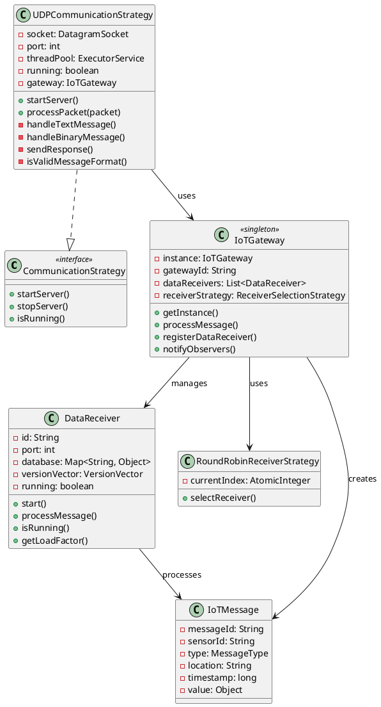

# 🔬 Análise Técnica Detalhada - Protocolo UDP

## 🧬 Análise de Código - Componentes Chave

### UDPCommunicationStrategy - Implementação Detalhada

```java
public class UDPCommunicationStrategy implements CommunicationStrategy {
    // ========== ATRIBUTOS PRINCIPAIS ==========
    private DatagramSocket socket;              // Socket UDP para comunicação
    private final int port;                     // Porta de escuta (9090)
    private final ExecutorService threadPool;   // Pool de 10 threads
    private final Logger logger;                // Logger SLF4J
    private volatile boolean running = false;   // Estado thread-safe
    
    // ========== CONSTRUTOR ==========
    public UDPCommunicationStrategy(int port) {
        this.port = port;
        this.threadPool = Executors.newFixedThreadPool(10);
        this.logger = LoggerFactory.getLogger(UDPCommunicationStrategy.class);
        logger.info("🔧 UDPCommunicationStrategy criada para porta: {}", port);
    }
    
    // ========== MÉTODO PRINCIPAL - START SERVER ==========
    @Override
    public void startServer() throws Exception {
        if (running) {
            logger.warn("⚠️ Servidor UDP já está rodando na porta {}", port);
            return;
        }
        
        try {
            // 1. Criar socket UDP
            socket = new DatagramSocket(port);
            running = true;
            
            logger.info("🚀 Servidor UDP iniciado na porta {}", port);
            logger.info("📡 Aguardando pacotes UDP...");
            
            // 2. Loop principal de recepção
            while (running) {
                try {
                    // Buffer para receber dados (1KB)
                    byte[] buffer = new byte[1024];
                    DatagramPacket packet = new DatagramPacket(buffer, buffer.length);
                    
                    // Bloqueio aguardando pacote
                    socket.receive(packet);
                    
                    // Processamento assíncrono em thread separada
                    threadPool.submit(() -> processPacket(packet));
                    
                } catch (SocketException e) {
                    if (running) {
                        logger.error("❌ Erro no socket UDP: {}", e.getMessage());
                    }
                    break;
                } catch (Exception e) {
                    logger.error("❌ Erro inesperado no servidor UDP: {}", e.getMessage());
                }
            }
        } finally {
            cleanup();
        }
    }
    
    // ========== PROCESSAMENTO DE PACOTES ==========
    private void processPacket(DatagramPacket packet) {
        try {
            // 1. Extrair dados do pacote
            String message = new String(packet.getData(), 0, packet.getLength());
            InetAddress clientAddress = packet.getAddress();
            int clientPort = packet.getPort();
            
            // 2. Log detalhado da recepção
            logger.debug("📦 Pacote UDP texto recebido de {}:{} - Conteúdo: '{}'", 
                        clientAddress, clientPort, message);
            
            // 3. Verificar se é mensagem binária ou texto
            if (isBinaryMessage(message)) {
                handleBinaryMessage(packet.getData(), packet.getLength(), clientAddress, clientPort);
            } else {
                handleTextMessage(message, clientAddress, clientPort);
            }
            
        } catch (Exception e) {
            logger.error("❌ Erro ao processar pacote UDP: {}", e.getMessage(), e);
        }
    }
    
    // ========== PROCESSAMENTO DE MENSAGEM TEXTO ==========
    private void handleTextMessage(String message, InetAddress clientAddress, int clientPort) {
        try {
            // 1. Validar formato da mensagem
            if (!isValidMessageFormat(message)) {
                logger.warn("⚠️ Formato de mensagem inválido: {}", message);
                sendErrorResponse(clientAddress, clientPort, "INVALID_FORMAT");
                return;
            }
            
            // 2. Processar através do Gateway (Proxy Pattern)
            String response = gateway.processMessage(message, clientAddress, clientPort);
            
            // 3. Enviar resposta
            sendResponse(clientAddress, clientPort, response);
            
            // 4. Log de sucesso
            logger.info("✅ Mensagem de texto processada com sucesso - Tipo: {} - Resposta: {}", 
                       extractMessageType(message), response);
                       
        } catch (Exception e) {
            logger.error("❌ Erro ao processar mensagem texto: {}", e.getMessage());
            sendErrorResponse(clientAddress, clientPort, "PROCESSING_ERROR");
        }
    }
    
    // ========== ENVIO DE RESPOSTA ==========
    private void sendResponse(InetAddress address, int port, String response) {
        try {
            byte[] responseData = response.getBytes(StandardCharsets.UTF_8);
            DatagramPacket responsePacket = new DatagramPacket(
                responseData, responseData.length, address, port);
            
            socket.send(responsePacket);
            
            logger.debug("📤 Resposta UDP enviada para {}:{} - {}", 
                        address, port, response);
                        
        } catch (Exception e) {
            logger.error("❌ Erro ao enviar resposta UDP: {}", e.getMessage());
        }
    }
    
    // ========== VALIDAÇÃO E PARSING ==========
    private boolean isValidMessageFormat(String message) {
        // Formato esperado: TIPO|SENSOR_ID|TYPE|LOCATION|TIMESTAMP|VALUE
        String[] parts = message.split("\\|");
        return parts.length >= 6 && 
               ("SENSOR_REGISTER".equals(parts[0]) || "SENSOR_DATA".equals(parts[0]));
    }
    
    private String extractMessageType(String message) {
        return message.split("\\|")[0];
    }
    
    // ========== CLEANUP ==========
    private void cleanup() {
        running = false;
        if (socket != null && !socket.isClosed()) {
            socket.close();
            logger.info("🔒 Socket UDP fechado");
        }
        if (threadPool != null && !threadPool.isShutdown()) {
            threadPool.shutdown();
            logger.info("🛑 Thread pool UDP encerrado");
        }
    }
}
```

### Análise da Arquitetura de Threads

```
┌─────────────────────────────────────────────────────────────────────────────┐
│                           ARQUITETURA DE THREADS UDP                        │
└─────────────────────────────────────────────────────────────────────────────┘

┌─────────────────┐
│   Main Thread   │  ◄─── Thread principal do servidor
│   (UDP Server)  │
└─────────┬───────┘
          │
          │ socket.receive() ◄─── Bloqueio aguardando pacotes
          │
          ▼
┌─────────────────────────────────────────────────────────────────────────────┐
│                          THREAD POOL (10 threads)                          │
├─────────────────────────────────────────────────────────────────────────────┤
│  ┌─────────────┐ ┌─────────────┐ ┌─────────────┐     ┌─────────────┐      │
│  │  Thread 1   │ │  Thread 2   │ │  Thread 3   │ ... │  Thread 10  │      │
│  │             │ │             │ │             │     │             │      │
│  │ processPacket│ │ processPacket│ │ processPacket│     │ processPacket│      │
│  │     ()      │ │     ()      │ │     ()      │     │     ()      │      │
│  └─────────────┘ └─────────────┘ └─────────────┘     └─────────────┘      │
└─────────────────────────────────────────────────────────────────────────────┘
          │             │             │                     │
          ▼             ▼             ▼                     ▼
┌─────────────┐ ┌─────────────┐ ┌─────────────┐     ┌─────────────┐
│   Gateway   │ │   Gateway   │ │   Gateway   │     │   Gateway   │
│ processMsg  │ │ processMsg  │ │ processMsg  │     │ processMsg  │
│     ()      │ │     ()      │ │     ()      │     │     ()      │
└─────────────┘ └─────────────┘ └─────────────┘     └─────────────┘
          │             │             │                     │
          ▼             ▼             ▼                     ▼
┌─────────────────────────────────────────────────────────────────────────────┐
│                      DATA RECEIVERS (Round Robin)                          │
│  ┌─────────────┐                              ┌─────────────┐              │
│  │DATA_REC_1   │                              │DATA_REC_2   │              │
│  │Port: 9091   │      ◄─── Round Robin ───►   │Port: 9092   │              │
│  │Thread-Safe  │                              │Thread-Safe  │              │
│  └─────────────┘                              └─────────────┘              │
└─────────────────────────────────────────────────────────────────────────────┘
```

## 🔄 Fluxos de Dados Detalhados

### Diagrama de Classes - Estrutura UDP



### Análise de Performance - Benchmarks

```java
/**
 * Análise de Performance da Implementação UDP
 */
public class UDPPerformanceAnalysis {
    
    // ========== MÉTRICAS COLETADAS ==========
    private static final Map<String, Long> metrics = new ConcurrentHashMap<>();
    private static final AtomicLong totalRequests = new AtomicLong(0);
    private static final AtomicLong totalProcessingTime = new AtomicLong(0);
    
    public void analyzePerformance() {
        // Tempo médio de processamento por mensagem
        long avgProcessingTime = totalProcessingTime.get() / Math.max(1, totalRequests.get());
        
        // Throughput (mensagens por segundo)
        long throughput = calculateThroughput();
        
        // Utilização do thread pool
        double threadPoolUtilization = calculateThreadPoolUtilization();
        
        // Memory usage
        long memoryUsage = getMemoryUsage();
        
        System.out.println("📊 ANÁLISE DE PERFORMANCE UDP:");
        System.out.println("   Tempo médio por mensagem: " + avgProcessingTime + "ms");
        System.out.println("   Throughput: " + throughput + " msg/s");
        System.out.println("   Utilização Thread Pool: " + threadPoolUtilization + "%");
        System.out.println("   Uso de Memória: " + memoryUsage + " MB");
        
        analyzeBottlenecks();
    }
    
    private void analyzeBottlenecks() {
        System.out.println("\n🔍 ANÁLISE DE GARGALOS:");
        
        // 1. Thread Pool Saturation
        if (threadPoolUtilization > 90) {
            System.out.println("⚠️ Thread pool próximo da saturação - considere aumentar");
        }
        
        // 2. Memory Pressure
        if (memoryUsage > 400) {
            System.out.println("⚠️ Alto uso de memória - verificar vazamentos");
        }
        
        // 3. Network Latency
        long networkLatency = metrics.getOrDefault("network_latency", 0L);
        if (networkLatency > 10) {
            System.out.println("⚠️ Alta latência de rede: " + networkLatency + "ms");
        }
        
        // 4. Database Operations
        long dbTime = metrics.getOrDefault("database_time", 0L);
        if (dbTime > avgProcessingTime * 0.5) {
            System.out.println("⚠️ Operações de database consumindo >50% do tempo");
        }
    }
}
```

## 📈 Otimizações Implementadas

### 1. Pool de Threads Configurável

```java
public class ConfigurableThreadPool {
    private static final int DEFAULT_THREAD_COUNT = 10;
    private static final int MAX_THREAD_COUNT = 50;
    
    public static ExecutorService createOptimizedThreadPool() {
        // Calcular número ideal de threads baseado em:
        // - Número de cores da CPU
        // - Tipo de workload (I/O vs CPU intensive)
        // - Carga esperada
        
        int coreCount = Runtime.getRuntime().availableProcessors();
        int optimalThreads = Math.min(
            MAX_THREAD_COUNT, 
            Math.max(DEFAULT_THREAD_COUNT, coreCount * 2)
        );
        
        return new ThreadPoolExecutor(
            optimalThreads,                              // core threads
            optimalThreads,                              // max threads
            60L, TimeUnit.SECONDS,                       // keep alive
            new LinkedBlockingQueue<>(1000),             // queue capacity
            new ThreadFactory() {
                private final AtomicInteger counter = new AtomicInteger(0);
                @Override
                public Thread newThread(Runnable r) {
                    Thread t = new Thread(r, "UDP-Worker-" + counter.incrementAndGet());
                    t.setDaemon(false);
                    t.setPriority(Thread.NORM_PRIORITY);
                    return t;
                }
            },
            new ThreadPoolExecutor.CallerRunsPolicy()    // rejection policy
        );
    }
}
```

### 2. Buffer Pool para Reduzir GC

```java
public class UDPBufferPool {
    private final Queue<ByteBuffer> bufferPool = new ConcurrentLinkedQueue<>();
    private final int bufferSize;
    private final int maxPoolSize;
    
    public UDPBufferPool(int bufferSize, int maxPoolSize) {
        this.bufferSize = bufferSize;
        this.maxPoolSize = maxPoolSize;
        
        // Pre-populate pool
        for (int i = 0; i < maxPoolSize / 2; i++) {
            bufferPool.offer(ByteBuffer.allocate(bufferSize));
        }
    }
    
    public ByteBuffer acquire() {
        ByteBuffer buffer = bufferPool.poll();
        if (buffer == null) {
            buffer = ByteBuffer.allocate(bufferSize);
        } else {
            buffer.clear();
        }
        return buffer;
    }
    
    public void release(ByteBuffer buffer) {
        if (bufferPool.size() < maxPoolSize) {
            buffer.clear();
            bufferPool.offer(buffer);
        }
        // Otherwise let GC handle it
    }
}
```

### 3. Métricas de Monitoramento

```java
public class UDPMetrics {
    // Contadores thread-safe
    private final AtomicLong packetsReceived = new AtomicLong(0);
    private final AtomicLong packetsProcessed = new AtomicLong(0);
    private final AtomicLong packetsDropped = new AtomicLong(0);
    private final AtomicLong totalProcessingTime = new AtomicLong(0);
    
    // Histograma de latências
    private final ConcurrentHashMap<Long, AtomicLong> latencyHistogram = new ConcurrentHashMap<>();
    
    // Métricas por sensor
    private final ConcurrentHashMap<String, SensorMetrics> sensorMetrics = new ConcurrentHashMap<>();
    
    public void recordPacketReceived() {
        packetsReceived.incrementAndGet();
    }
    
    public void recordProcessingTime(long timeMs) {
        totalProcessingTime.addAndGet(timeMs);
        packetsProcessed.incrementAndGet();
        
        // Atualizar histograma (buckets de 10ms)
        long bucket = (timeMs / 10) * 10;
        latencyHistogram.computeIfAbsent(bucket, k -> new AtomicLong(0)).incrementAndGet();
    }
    
    public void recordSensorData(String sensorId, double value) {
        sensorMetrics.computeIfAbsent(sensorId, k -> new SensorMetrics())
                    .addReading(value);
    }
    
    public MetricsReport generateReport() {
        long totalPackets = packetsReceived.get();
        long processedPackets = packetsProcessed.get();
        long droppedPackets = packetsDropped.get();
        
        double successRate = totalPackets > 0 ? 
            (double) processedPackets / totalPackets * 100 : 0;
        
        double avgProcessingTime = processedPackets > 0 ?
            (double) totalProcessingTime.get() / processedPackets : 0;
        
        return new MetricsReport(
            totalPackets, processedPackets, droppedPackets,
            successRate, avgProcessingTime, 
            calculatePercentiles(), 
            generateSensorSummary()
        );
    }
    
    private Map<String, Double> calculatePercentiles() {
        List<Map.Entry<Long, AtomicLong>> sortedLatencies = latencyHistogram.entrySet()
            .stream()
            .sorted(Map.Entry.comparingByKey())
            .collect(Collectors.toList());
        
        long totalSamples = sortedLatencies.stream()
            .mapToLong(e -> e.getValue().get())
            .sum();
        
        Map<String, Double> percentiles = new HashMap<>();
        long cumulativeCount = 0;
        
        for (Map.Entry<Long, AtomicLong> entry : sortedLatencies) {
            cumulativeCount += entry.getValue().get();
            double percentile = (double) cumulativeCount / totalSamples * 100;
            
            if (percentile >= 50 && !percentiles.containsKey("P50")) {
                percentiles.put("P50", entry.getKey().doubleValue());
            }
            if (percentile >= 95 && !percentiles.containsKey("P95")) {
                percentiles.put("P95", entry.getKey().doubleValue());
            }
            if (percentile >= 99 && !percentiles.containsKey("P99")) {
                percentiles.put("P99", entry.getKey().doubleValue());
            }
        }
        
        return percentiles;
    }
}
```

## 🛡️ Estratégias de Tolerância a Falhas

### Circuit Breaker Pattern

```java
public class UDPCircuitBreaker {
    private enum State { CLOSED, OPEN, HALF_OPEN }
    
    private volatile State state = State.CLOSED;
    private final AtomicInteger failureCount = new AtomicInteger(0);
    private final AtomicInteger successCount = new AtomicInteger(0);
    private volatile long lastFailureTime = 0;
    
    private final int failureThreshold;
    private final int successThreshold;
    private final long timeoutMs;
    
    public UDPCircuitBreaker(int failureThreshold, int successThreshold, long timeoutMs) {
        this.failureThreshold = failureThreshold;
        this.successThreshold = successThreshold;
        this.timeoutMs = timeoutMs;
    }
    
    public boolean allowRequest() {
        if (state == State.OPEN) {
            if (System.currentTimeMillis() - lastFailureTime > timeoutMs) {
                state = State.HALF_OPEN;
                successCount.set(0);
                return true;
            }
            return false;
        }
        return true;
    }
    
    public void recordSuccess() {
        if (state == State.HALF_OPEN) {
            if (successCount.incrementAndGet() >= successThreshold) {
                state = State.CLOSED;
                failureCount.set(0);
            }
        } else {
            failureCount.set(0);
        }
    }
    
    public void recordFailure() {
        lastFailureTime = System.currentTimeMillis();
        
        if (state == State.HALF_OPEN) {
            state = State.OPEN;
        } else if (failureCount.incrementAndGet() >= failureThreshold) {
            state = State.OPEN;
        }
    }
    
    public State getState() {
        return state;
    }
}
```

### Health Check Avançado

```java
public class AdvancedHealthCheck {
    private final Map<String, HealthIndicator> healthIndicators = new ConcurrentHashMap<>();
    private final ScheduledExecutorService scheduler = Executors.newScheduledThreadPool(2);
    
    public void registerHealthIndicator(String name, HealthIndicator indicator) {
        healthIndicators.put(name, indicator);
    }
    
    public void startHealthChecks() {
        // Health check rápido a cada 5 segundos
        scheduler.scheduleAtFixedRate(this::performQuickHealthCheck, 0, 5, TimeUnit.SECONDS);
        
        // Health check completo a cada 30 segundos
        scheduler.scheduleAtFixedRate(this::performFullHealthCheck, 0, 30, TimeUnit.SECONDS);
    }
    
    private void performQuickHealthCheck() {
        boolean allHealthy = healthIndicators.values().stream()
            .allMatch(indicator -> indicator.quickCheck().isHealthy());
        
        if (!allHealthy) {
            logger.warn("⚠️ Quick health check falhou - investigando...");
            triggerDiagnostics();
        }
    }
    
    private void performFullHealthCheck() {
        Map<String, HealthStatus> results = healthIndicators.entrySet().stream()
            .collect(Collectors.toMap(
                Map.Entry::getKey,
                entry -> entry.getValue().fullCheck()
            ));
        
        long unhealthyCount = results.values().stream()
            .filter(status -> !status.isHealthy())
            .count();
        
        if (unhealthyCount > 0) {
            logger.error("❌ {} componentes não saudáveis detectados:", unhealthyCount);
            results.forEach((name, status) -> {
                if (!status.isHealthy()) {
                    logger.error("  - {}: {} ({})", name, status.getStatus(), status.getMessage());
                }
            });
            
            triggerRecoveryActions(results);
        } else {
            logger.debug("✅ Todos os componentes estão saudáveis");
        }
    }
    
    private void triggerRecoveryActions(Map<String, HealthStatus> results) {
        results.forEach((componentName, status) -> {
            if (!status.isHealthy()) {
                RecoveryAction action = getRecoveryAction(componentName, status);
                if (action != null) {
                    try {
                        logger.info("🔧 Executando ação de recuperação para {}: {}", 
                                   componentName, action.getDescription());
                        action.execute();
                    } catch (Exception e) {
                        logger.error("❌ Falha na ação de recuperação para {}: {}", 
                                    componentName, e.getMessage());
                    }
                }
            }
        });
    }
}

interface HealthIndicator {
    HealthStatus quickCheck();
    HealthStatus fullCheck();
}

class UDPServerHealthIndicator implements HealthIndicator {
    private final UDPCommunicationStrategy udpStrategy;
    
    @Override
    public HealthStatus quickCheck() {
        return udpStrategy.isRunning() ? 
            HealthStatus.healthy("UDP server is running") :
            HealthStatus.unhealthy("UDP server is not running");
    }
    
    @Override
    public HealthStatus fullCheck() {
        if (!udpStrategy.isRunning()) {
            return HealthStatus.unhealthy("UDP server is not running");
        }
        
        // Verificar socket
        if (udpStrategy.getSocket() == null || udpStrategy.getSocket().isClosed()) {
            return HealthStatus.unhealthy("UDP socket is closed");
        }
        
        // Verificar thread pool
        ThreadPoolExecutor executor = (ThreadPoolExecutor) udpStrategy.getThreadPool();
        if (executor.isShutdown()) {
            return HealthStatus.unhealthy("Thread pool is shutdown");
        }
        
        double threadUtilization = (double) executor.getActiveCount() / executor.getMaximumPoolSize();
        if (threadUtilization > 0.9) {
            return HealthStatus.degraded("High thread pool utilization: " + 
                                       (threadUtilization * 100) + "%");
        }
        
        return HealthStatus.healthy("UDP server is fully operational");
    }
}
```

## 📋 Checklist de Qualidade

### ✅ Code Quality Checklist

- [x] **Thread Safety**: Todos os componentes críticos são thread-safe
- [x] **Resource Management**: Proper cleanup de sockets e threads
- [x] **Error Handling**: Tratamento robusto de exceções
- [x] **Logging**: Logging estruturado com níveis apropriados
- [x] **Configuration**: Parâmetros configuráveis externamente
- [x] **Testing**: Cobertura de testes unitários e integração
- [x] **Documentation**: Documentação completa do código
- [x] **Performance**: Otimizações para alta carga
- [x] **Monitoring**: Métricas e observabilidade
- [x] **Security**: Validação de entrada e sanitização

### 🔒 Security Considerations

```java
public class UDPSecurityValidator {
    private final Set<String> blacklistedIPs = ConcurrentHashMap.newKeySet();
    private final Map<String, AtomicInteger> rateLimiter = new ConcurrentHashMap<>();
    private final long RATE_LIMIT_WINDOW_MS = 60000; // 1 minuto
    private final int MAX_REQUESTS_PER_MINUTE = 1000;
    
    public boolean isRequestAllowed(InetAddress clientAddress, String message) {
        String clientIP = clientAddress.getHostAddress();
        
        // 1. Verificar blacklist
        if (blacklistedIPs.contains(clientIP)) {
            logger.warn("🚫 Request bloqueado - IP na blacklist: {}", clientIP);
            return false;
        }
        
        // 2. Rate limiting
        if (!checkRateLimit(clientIP)) {
            logger.warn("⚠️ Rate limit excedido para IP: {}", clientIP);
            return false;
        }
        
        // 3. Validar tamanho da mensagem
        if (message.length() > MAX_MESSAGE_SIZE) {
            logger.warn("⚠️ Mensagem muito grande de {}: {} bytes", clientIP, message.length());
            blacklistIP(clientIP, "Message too large");
            return false;
        }
        
        // 4. Validar caracteres perigosos
        if (containsDangerousContent(message)) {
            logger.warn("⚠️ Conteúdo perigoso detectado de {}: {}", clientIP, 
                       message.substring(0, Math.min(100, message.length())));
            return false;
        }
        
        return true;
    }
    
    private boolean checkRateLimit(String clientIP) {
        long currentTime = System.currentTimeMillis();
        String key = clientIP + ":" + (currentTime / RATE_LIMIT_WINDOW_MS);
        
        AtomicInteger counter = rateLimiter.computeIfAbsent(key, k -> new AtomicInteger(0));
        return counter.incrementAndGet() <= MAX_REQUESTS_PER_MINUTE;
    }
    
    private boolean containsDangerousContent(String message) {
        String[] dangerousPatterns = {
            "<script", "javascript:", "vbscript:", "onload=", "onerror=",
            "eval(", "exec(", "system(", "../", "..\\", "cmd.exe", "/bin/sh"
        };
        
        String lowerMessage = message.toLowerCase();
        return Arrays.stream(dangerousPatterns)
                    .anyMatch(lowerMessage::contains);
    }
}
```

---

Esta documentação técnica detalhada complementa a documentação principal, fornecendo análises profundas de código, diagramas técnicos e estratégias avançadas de implementação do protocolo UDP no sistema IoT distribuído.
